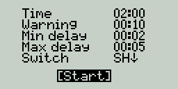
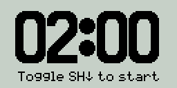

### Drone Racing Timer Lua script 

Plays start and finish sounds for a quad race.

* Configurable time intervals.
* Random race start delay.
* Warning before finish.
* Assigned to any free switch.
* Compatible with any OpenTX/EdgeTX/FreedomTX radio.

  

https://www.youtube.com/watch?v=hj8fPDgjJTs

### How to install
1. Download [zip-archive](https://github.com/alexeystn/droneracing-timer-lua-script/archive/master.zip) of this repository. (Code -> Download ZIP)
2. Copy `/SCRIPTS/TOOLS/` content to `/SCRIPTS/TOOLS/` directory on your SD card. (1 lua + 4 wav's)
3. Open `TOOLS` menu on your radio and run `Race timer`
 
 Feel free to contact me: https://t.me/AlexeyStn Your feedback is welcome!

-------

Inspired by GoRace script from [RCdiy.ca](http://rcdiy.ca/quad-race-start-sequence-gorace/)
